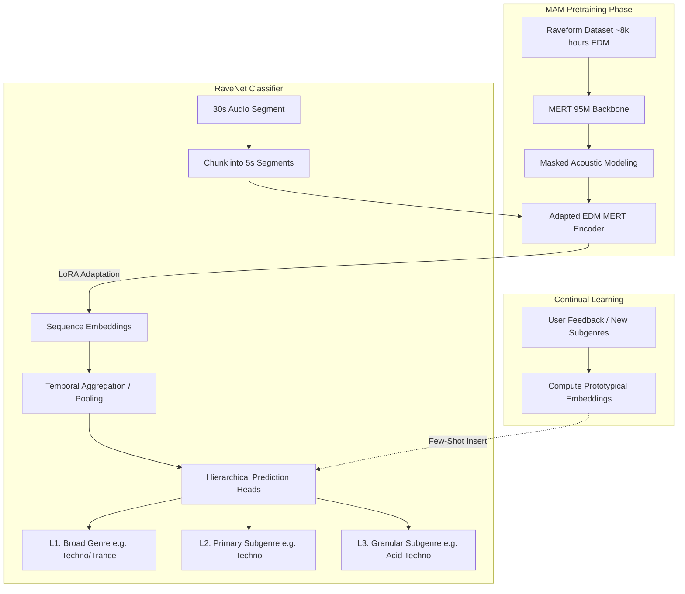
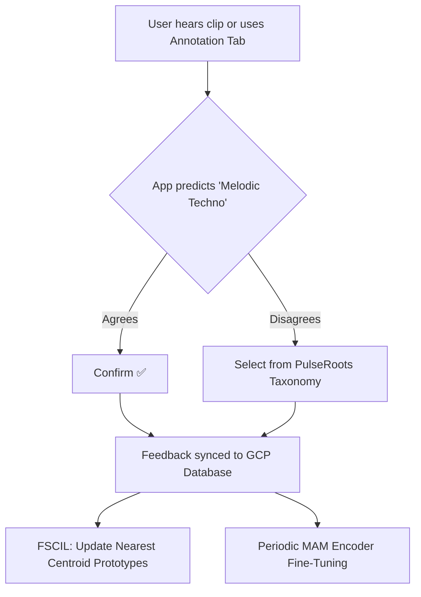

# Tech Stack

## Overview

This document defines the finalized technologies and architecture for the Electric Taste project. Decisions are based on the Phase 2 research findings, including a validated MERT prototype that achieved 64.5% accuracy on 10-genre classification using a frozen encoder on local hardware.

---

## Classification Architecture (RaveNet & MAM Pretraining)

### Primary Pipeline: RaveNet Hierarchical Classifier

The core architecture, dubbed **RaveNet**, relies on a MERT backbone pre-trained via Masked Acoustic Modeling (MAM) on the massive EDM Raveform dataset, followed by a hierarchical multi-label classification head and prototypical contrastive learning for continuous adaptation.

### Core Model: MERT (Music Audio Representation Transformer)

| Property | Value |
|---|---|
| **Model** | [MERT-v1-95M](https://huggingface.co/m-a-p/MERT-v1-95M) (adapted to RaveNet via MAM) |
| **Type** | Self-supervised music foundation model (BERT-style transformer) |
| **Input** | Raw audio waveform (24kHz, chunked into 5s segments for temporal aggregation) |
| **Output** | 768-dim embeddings per time step → aggregated to clip-level representation |
| **Parameters** | 94.4M (95M variant) |
| **On-Device Format** | **iOS**: CoreML `.mlpackage` FP16 / INT8  **Android**: ONNX FP32 / INT8 (via `QLinearConv`) |

**Why MERT & MAM**: Purpose-built for music understanding. We adapt it to EDM using Masked Acoustic Modeling (MAM) with Acoustic (EnCodec/RVQ-VAE) and Musical (CQT) teachers. Parameter-Efficient Fine-Tuning (LoRA) is utilized for the downstream RaveNet classifier to prevent catastrophic forgetting.

### Classification Head (RaveNet)

The classification head is a hierarchical multi-label DAG-aware classifier. Instead of standard cross-entropy, the projection layer uses Supervised Contrastive Learning (SupCon) to group samples into a Prototypical Contrastive Learning Space. This enables a Nearest Centroid Classifier that handles multi-label samples and Few-Shot Class Incremental Learning (FSCIL) for instant, user-driven taxonomy expansion without full retraining.

### Fallback / Comparison Models

| Model | Role | Notes |
|---|---|---|
| [CLAP](https://github.com/LAION-AI/CLAP) (86M params) | Zero-shot prototyping | Classify with text prompts, no training needed |
| [PANNs CNN14](https://github.com/qiuqiangkong/audioset_tagging_cnn) (80M) | Baseline comparison | Well-documented, fast |
| [Qwen2-Audio](https://huggingface.co/Qwen/Qwen2-Audio-7B-Instruct) (8.2B) | Future RLHF reasoning layer | Conversational UX, too large for primary classifier |

---

## Audio Feature & Metadata Extraction

> **Note**: While MERT ingests raw audio directly, we utilize Librosa for enhanced metadata extraction (Phase 9) and robust file conversion (Phase 10).

| Tool / Library | Purpose |
|---|---|
| **Librosa** | Extracting Tempo (BPM), Key Signature, and audio preprocessing |
| **FFmpeg/yt-dlp** | Stripping audio from video uploads (MP4, MOV) and converting various formats (FLAC, MP3, WAV, AAC, OGG) to 24kHz mono |

### Audio Preprocessing Pipeline
1. **Upload/Capture**: User uploads a file (audio/video) to Web MVP, or captures via mobile mic.
2. **Extraction**: If video, seamlessly strip audio stream.
3. **Resample**: Convert to 24kHz mono (MERT's expected input format).
4. **Metadata Extraction**: Use Librosa to compute BPM and key signature for UI display.
5. **Normalize**: Peak normalize to [-1, 1].
6. **Execute**: Run inference using the Web/Cloud pipeline (Web MVP) or embedded CoreML/ONNX model (Mobile MVP).

---

## Data & Datasets (Finalized)

| Source | Has Audio? | Subgenres | Status |
|---|---|---|---|
| **GTZAN** (HuggingFace) | ✅ 30s WAV | 10 broad genres | ✅ Downloaded (`data/gtzan_audio/`) — pipeline validation |
| **Beatport Top 100** (Kaggle) | ❌ Features CSV only | 20+ EDM subgenres | ✅ In `data/` — feature-based baseline |
| **MTG-Jamendo** (HuggingFace) | ✅ Full-length MP3 | ~16K electronic tracks | 🔜 Next download — EDM fine-tuning |
| User-generated data | ✅ | Custom taxonomy | Future — RLHF feedback loop |

---

## Mobile Application

| Technology | Purpose |
|---|---|
| **React Native** or **Flutter** | Cross-platform mobile framework (iOS + Android) |
| **CoreML** | On-device execution framework for iOS (FP16/INT8 models) |
| **ONNX Runtime Mobile** | On-device execution framework for Android (`onnxruntime-android` AAR package) |
| Native audio APIs | Microphone access and real-time audio capture |
| Native bridges / plugins | Custom native bridges for audio resampling (24kHz mono) and model execution |
| REST API | Lightweight communication with the backend service for profile syncing, analytics, and RLHF feedback collection |

---

## Web MVP, Backend & Infrastructure

| Technology | Purpose |
|---|---|
| **Web Browser MVP** | Hosted on GitHub Pages, providing file upload, annotation tabs, and PulseRoots taxonomy integrations |
| **Python (FastAPI)** | Lightweight backend API for ML routing (Web MVP), syncing profiles, and feedback |
| **GCP Cloud Database** | Centralized Postgres database for storing user accounts, annotations, RLHF tags, and audio clip references |
| **GCP Compute** | Used for dataset downloading, MAM pre-training, fine-tuning, and offline retraining workloads |
| **Docker** | Containerized deployment of backend services |

### Hardware & Inference Requirements

| Stage | Hardware | Notes |
|---|---|---|
| **Development / prototyping** | Apple Silicon Mac (16GB) | MERT-95M runs locally via MPS backend / CoreML |
| **Model Training (Phase 4)** | GCP A100 or Colab T4 | Provisioned for MAM pre-training on Raveform mixes and EDM fine-tuning |
| **Production Inference (MVP)** | **On-Device** (Mobile CPU / Neural Engine) | Runs natively on user device: eliminates server costs and connection latency |
| **Model Retraining (Post-MVP)** | GCP A100 or Colab T4 | Scheduled offline batch jobs for MERT retraining based on user feedback |

---

## Recommendation Engine (Phase 14)

| Approach | Description |
|---|---|
| **Content-based filtering** | Recommend based on MERT embedding similarity to tracks the user has rated highly |
| **Collaborative filtering** | Recommend based on similar users' preferences |
| **Hybrid approach** | Combine embedding similarity and collaborative signals |

> **Note**: MERT embeddings double as the recommendation engine's feature backbone. Tracks with similar 768-dim embeddings will sound similar — enabling "find more like this" without a separate feature pipeline.

---

## User Profiles & Feedback Loop (Phase 13)

---

## Validated Decisions (Phase 2 & Spike)

| Decision | Status | Evidence |
|---|---|---|
| MERT as primary classifier | ✅ Validated | 64.5% on GTZAN (frozen encoder, 5s clips, minimal classifier) |
| Raw audio ingestion (not feature→LLM) | ✅ Decided | End-to-end models outperform feature pipelines; removes Librosa fragility |
| Apple Silicon local inference | ✅ Validated | 0.14s/file, ~2–3GB memory on MPS |
| Librosa → Qwen text pipeline | ❌ Deprecated | Fragile, lower accuracy ceiling, unnecessary indirection |
| GTZAN for pipeline validation | ✅ Complete | 999 files processed, musically-sensible confusions |
| Beatport CSV for feature baseline | ✅ Available | In `data/`, ready for RF/XGBoost comparison |
| **On-device CoreML (iOS)** | ✅ Validated | Successfully converted to FP16 (189 MB) and INT8 (95 MB). High-accuracy parity (0.9997 / 0.9988 cosine similarity vs PyTorch) |
| **On-device ONNX (Android)** | ✅ Validated | Successfully validated ONNX FP32 (361 MB) on Pixel 10 Pro XL. Latency **7.3 seconds** for 30-second audio clip (well below 20s budget) |
| **Defer Cloud GPU API** | ✅ Decided | On-device execution solves the festival/club offline connectivity problem and reduces backend hosting costs to near-zero |
